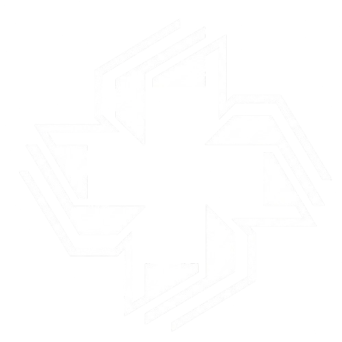

# 🏥 Aegis mHealth Monitoring System

<div align="center">
  
  <h3>Enterprise Health Monitoring & mHealth Platform</h3>
  <p>A comprehensive healthcare management system for doctors, patients, and administrators</p>
</div>

---

## 📋 Table of Contents

- [Overview](#overview)
- [Features](#features)
- [Tech Stack](#tech-stack)
- [System Architecture](#system-architecture)
- [Installation](#installation)
- [Environment Variables](#environment-variables)
- [Database Seeding](#database-seeding)
- [Running the Application](#running-the-application)
- [Login Credentials](#login-credentials)
- [API Documentation](#api-documentation)
- [Project Structure](#project-structure)
- [Screenshots](#screenshots)a
- [Contributing](#contributing)
- [License](#license)

---

## 📖 Overview

**Aegis** is a full-stack health monitoring system that enables seamless communication between healthcare providers and patients. It provides real-time patient monitoring, appointment scheduling, prescription management, referral systems, and comprehensive analytics.

### Key Features:
- ✅ Role-based access (Admin, Doctor, Patient)
- ✅ Real-time patient vitals tracking
- ✅ Appointment scheduling with location management
- ✅ Digital prescriptions with PDF generation
- ✅ Doctor-to-doctor referral system
- ✅ In-app notifications
- ✅ Advanced analytics dashboards
- ✅ Hospital and specialization management

---

## ✨ Features

### 👨‍⚕️ For Doctors
| Feature | Description |
|---------|-------------|
| Patient Management | Add/remove patients, view medical history |
| Vitals Recording | Record and track patient vitals (BP, heart rate, temperature, O2) |
| Health Trends | Visual charts showing patient health over time |
| Medical Conditions | Manage patient diagnoses with severity levels |
| Prescriptions | Create digital prescriptions with PDF download |
| Appointments | Schedule and manage appointments (list/calendar view) |
| Referrals | Refer patients to other doctors with priority levels |
| Notifications | Real-time alerts for referrals and appointments |

### 🧑‍⚕️ For Patients
| Feature | Description |
|---------|-------------|
| Health Records | View personal vitals history |
| Prescriptions | View and download prescriptions |
| Appointments | See upcoming appointments with location |
| Doctor Info | View assigned physician details |
| Referrals | Track referral status |
| Account Management | Update profile and change password |

### 👑 For Admins
| Feature | Description |
|---------|-------------|
| Dashboard | System-wide statistics |
| Hospital Management | CRUD operations for hospitals |
| Doctor Management | Create, edit, activate/deactivate doctors |
| Patient Management | Create, edit, activate/deactivate patients |
| Specializations | Manage medical specializations |
| Analytics | Global patient condition distribution |

---

## 🛠️ Tech Stack

### Backend
| Technology | Purpose |
|------------|---------|
| Node.js | Runtime environment |
| Express.js | Web framework |
| MongoDB | Database |
| Mongoose | ODM |
| JWT | Authentication |
| CryptoJS | Password encryption |
| Bcryptjs | Password hashing |

### Frontend
| Technology | Purpose |
|------------|---------|
| React 18 | UI framework |
| React Router | Navigation |
| Axios | HTTP client |
| Recharts | Data visualization |
| Lucide React | Icons |
| HTML2Canvas + jsPDF | PDF generation |
| CSS Modules | Styling |

---

## 🏗️ System Architecture

```
┌─────────────────────────────────────────────────────────────┐
│                         Client Browser                      │
│  ┌─────────────┐  ┌─────────────┐  ┌─────────────┐          │
│  │   Landing   │  │   Doctor    │  │   Patient   │          │
│  │    Page     │  │  Dashboard  │  │  Dashboard  │          │
│  └─────────────┘  └─────────────┘  └─────────────┘          │
│         │              │                  │                 │
│         └──────────────┼──────────────────┘                 │
│                        │                                    │
│                   Axios HTTP Client                         │
└────────────────────────│────────────────────────────────────┘
                         │
                         ▼
┌─────────────────────────────────────────────────────────────┐
│                      Express.js API                         │
│  ┌──────────┐ ┌──────────┐ ┌──────────┐ ┌──────────┐        │
│  │   Auth   │ │  Admin   │ │  Doctor  │ │ Patient  │        │
│  │  Routes  │ │  Routes  │ │  Routes  │ │  Routes  │        │
│  └──────────┘ └──────────┘ └──────────┘ └──────────┘        │
│                         │                                   │
│                    Middleware                               │
│          (Auth, Rate Limit, Helmet, CORS)                   │
└────────────────────────│────────────────────────────────────┘
                         │
                         ▼
┌─────────────────────────────────────────────────────────────┐
│                       MongoDB Atlas                         │
│  ┌─────────┐ ┌─────────┐ ┌─────────┐ ┌─────────┐            │
│  │  Users  │ │Patients │ │  Logs   │ │Hospital │            │
│  └─────────┘ └─────────┘ └─────────┘ └─────────┘            │
└─────────────────────────────────────────────────────────────┘
```

---

## 💻 Installation

### Prerequisites
- Node.js (v18 or higher)
- MongoDB (local or Atlas)
- npm or yarn

### Step 1: Clone the Repository
```bash
git clone https://github.com/yourusername/aegis.git
cd aegis
```

### Step 2: Install Backend Dependencies
```bash
cd backend
npm install express mongoose jsonwebtoken dotenv cors helmet express-rate-limit crypto-js
npm install -D nodemon
npm run dev

```

### Step 3: Install Frontend Dependencies
```bash
cd frontend
npm install axios react-router-dom lucide-react recharts html2canvas jspdf
npm start

```

### Step 4: Set up Environment Variables
Create `.env` files in both backend and frontend folders (see below).

---

## 🔐 Environment Variables

### Backend `.env` (backend/)
```env
NODE_ENV=development
PORT=5000
FRONTEND_URL=http://localhost:3000
JWT_SECRET=aegis_super_secret_key_2024_secure
MONGODB_URI=mongodb://localhost:27017/aegis

```

### Frontend `.env` (frontend/)
```env
REACT_APP_API_URL=http://localhost:5000/api
```

---

## 🗄️ Database Seeding

### Seed All Data
```bash
cd backend
node scripts/seed.js
```

### Delete Seeded Data
```bash
cd backend
node scripts/delete-seed.js
```

### Seed Data Summary
| Collection | Count |
|------------|-------|
| Hospitals | 5 |
| Specializations | 15 |
| Doctors | 8 |
| Patients | 8 |
| Health Logs | 80 |
| Appointments | 8 |
| Prescriptions | 8 |
| Referrals | 5 |
| Notifications | 16+ |

---

## 🚀 Running the Application

### Start Backend Server
```bash
cd backend
npm run dev
```
Server will run at: `http://localhost:5000`

### Start Frontend Development Server
```bash
cd frontend
npm start
```
App will run at: `http://localhost:3000`

### Production Build
```bash
cd frontend
npm run build
```

---

## 🔑 Login Credentials

### Admin Account
| Field | Value |
|-------|-------|
| Email | `admin@aegis.com` |
| Password | `admin123` |

### Doctor Accounts
| Email | Password | Specialization |
|-------|----------|----------------|
| `dr.smith@aegis.com` | `doctor123` | Cardiology |
| `dr.johnson@aegis.com` | `doctor123` | Neurology |
| `dr.williams@aegis.com` | `doctor123` | Pediatrics |
| `dr.brown@aegis.com` | `doctor123` | Orthopedics |

### Patient Accounts
| Email | Password |
|-------|----------|
| `john.doe@example.com` | `patient123` |
| `jane.smith@example.com` | `patient123` |
| `bob.wilson@example.com` | `patient123` |

---

## 📚 API Documentation

### Authentication Endpoints
| Method | Endpoint | Description |
|--------|----------|-------------|
| POST | `/api/auth/login` | User login |
| POST | `/api/auth/register` | User registration |
| GET | `/api/auth/profile` | Get user profile |
| PUT | `/api/auth/profile` | Update profile |
| PUT | `/api/auth/change-password` | Change password |

### Admin Endpoints
| Method | Endpoint | Description |
|--------|----------|-------------|
| GET | `/api/admin/dashboard/stats` | Dashboard statistics |
| GET | `/api/admin/hospitals` | Get all hospitals |
| POST | `/api/admin/hospitals` | Create hospital |
| PUT | `/api/admin/hospitals/:id` | Update hospital |
| DELETE | `/api/admin/hospitals/:id` | Delete hospital |
| GET | `/api/admin/doctors` | Get all doctors |
| POST | `/api/admin/doctors` | Create doctor |
| GET | `/api/admin/patients` | Get all patients |
| POST | `/api/admin/patients` | Create patient |
| GET | `/api/admin/specializations` | Get specializations |
| GET | `/api/admin/analytics/patients` | Global patient analytics |

### Doctor Endpoints
| Method | Endpoint | Description |
|--------|----------|-------------|
| GET | `/api/doctor/patients` | Get assigned patients |
| POST | `/api/doctor/patients/:patientId/health-logs` | Record vitals |
| GET | `/api/doctor/patients/:patientId/health-logs` | Get health logs |
| POST | `/api/doctor/referrals` | Send referral |
| GET | `/api/doctor/referrals/received` | Get received referrals |
| PUT | `/api/doctor/referrals/:id/respond` | Respond to referral |
| GET | `/api/doctor/appointments` | Get appointments |
| POST | `/api/doctor/appointments` | Create appointment |
| GET | `/api/doctor/prescriptions` | Get prescriptions |
| POST | `/api/doctor/prescriptions` | Create prescription |

### Patient Endpoints
| Method | Endpoint | Description |
|--------|----------|-------------|
| GET | `/api/patient/profile` | Get patient profile |
| GET | `/api/patient/my-health-logs` | Get health logs |
| GET | `/api/patient/my-prescriptions` | Get prescriptions |
| GET | `/api/patient/my-appointments` | Get appointments |
| GET | `/api/patient/my-referrals` | Get referrals |
| GET | `/api/patient/my-doctor` | Get assigned doctor |

---

## 📁 Project Structure

```
Aegis/
├── backend/
│   ├── controllers/
│   │   ├── auth.controller.js
│   │   ├── admin.controller.js
│   │   ├── doctor.controller.js
│   │   ├── patient.controller.js
│   │   ├── healthLog.controller.js
│   │   └── notification.controller.js
│   ├── models/
│   │   ├── User.model.js
│   │   ├── Patient.model.js
│   │   ├── HealthLog.model.js
│   │   ├── Hospital.model.js
│   │   ├── Specialization.model.js
│   │   ├── Appointment.model.js
│   │   ├── Prescription.model.js
│   │   ├── Referral.model.js
│   │   └── Notification.model.js
│   ├── routes/
│   │   ├── auth.routes.js
│   │   ├── admin.routes.js
│   │   ├── doctor.routes.js
│   │   ├── patient.routes.js
│   │   ├── healthLog.routes.js
│   │   └── notification.routes.js
│   ├── middleware/
│   │   └── auth.middleware.js
│   ├── scripts/
│   │   ├── seed.js
│   │   └── delete-seed.js
│   └── server.js
└── frontend/
    ├── public/
    │   └── images/
    │       └── logo-dark.png
    │       └── logo-light.png
    └── src/
        ├── components/
        │   ├── common/
        │   │   ├── Button/
        │   │   ├── Input/
        │   │   ├── Card/
        │   │   ├── Modal/
        │   │   ├── SearchInput/
        │   │   └── NotificationBell/
        │   └── features/
        │       ├── Landing/
        │       ├── Auth/
        │       ├── Doctor/
        │       ├── Patient/
        │       └── Admin/
        ├── contexts/
        │   └── AuthContext.jsx
        ├── services/
        │   └── api.js
        ├── styles/
        │   ├── global.css
        │   ├── variables.css
        │   ├── modal.css
        │   └── doctor-modal.css
        └── App.js
```

---
### Landing Page
[Landing page with hero section, features, and auth modal]

### Doctor Dashboard
- Patient list sidebar
- Vitals recording
- Health trends chart
- Medical conditions management
- Appointment scheduler (list + calendar)
- Referral system
- Prescription manager

### Patient Dashboard
- Personal information view
- Latest vitals display
- Health history table
- Prescriptions list
- Appointments with location
- Referrals tracking

### Admin Dashboard
- Statistics overview
- Hospital management
- Doctor management (grouped by specialization)
- Patient management
- Specialization management
- Global analytics

---

## 📄 License

This project is for educational purposes as part of a school project.

---

## Contributions

Health Monitoring & Health API System

| Avatar | Name | GitHub | Contributions |
|--------|------|--------|---------------|
|  | **Anne Loraine Pardillo** | [@luoijin](https://github.com/luoijin) | Full Stack Dev |


---